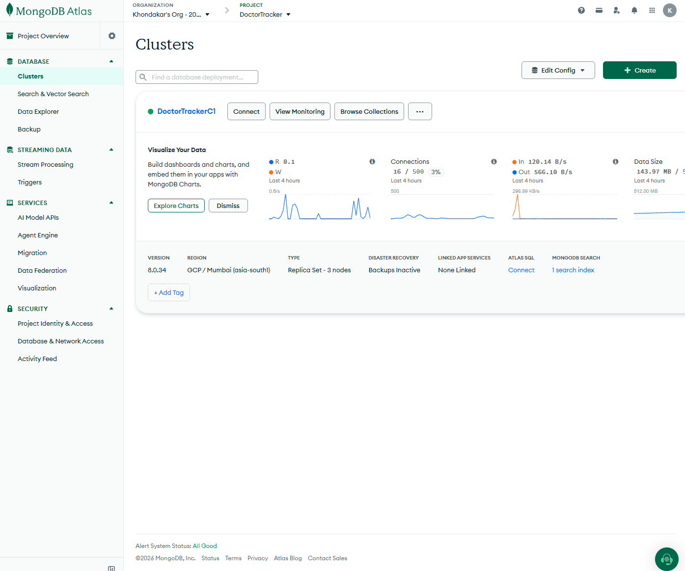
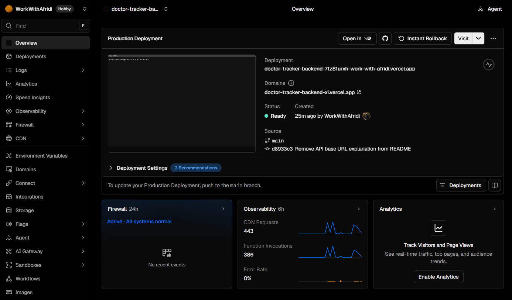

# Doctor Tracker API

## Description

Doctor Tracker API is the standalone backend for managing doctors, their patients, and care analytics. It provides authenticated REST endpoints with role-based access, validated inputs, searchable and paginated records, and MongoDB-derived dashboard statistics. The independent Next.js frontend consumes this Express service; MongoDB stores application records and revocable login sessions.

## Live links

| Resource                  | URL                                                                                  |
| ------------------------- | ------------------------------------------------------------------------------------ |
| Frontend application      | [Doctor Tracker](https://doctor-tracker-frontend-ten.vercel.app)                     |
| Frontend login            | [Sign in](https://doctor-tracker-frontend-ten.vercel.app/login)                      |
| Backend API documentation | [Swagger UI](https://doctor-tracker-backend-xi.vercel.app/docs/)                     |
| Backend health check      | [Health](https://doctor-tracker-backend-xi.vercel.app/health)                        |
| OpenAPI specification     | [OpenAPI JSON](https://doctor-tracker-backend-xi.vercel.app/openapi.json)            |
| Frontend repository       | [doctor-tracker-frontend](https://github.com/WorkWithAfridi/doctor-tracker-frontend) |
| Backend repository        | [doctor-tracker-backend](https://github.com/WorkWithAfridi/doctor-tracker-backend)   |

Reviewer login credentials are shared privately.

## Technology stack

| Area              | Technology                                        |
| ----------------- | ------------------------------------------------- |
| Runtime           | Node.js 24 LTS, TypeScript                        |
| REST server       | Express 5                                         |
| Database          | MongoDB, Mongoose                                 |
| Validation        | Zod                                               |
| Authentication    | bcrypt password hashes, HTTP-only cookie sessions |
| API documentation | OpenAPI 3.1, Swagger UI                           |
| Testing           | Node test runner, Supertest, tsx                  |
| Deployment        | Vercel with MongoDB Atlas                         |

## Features

- Administrator and staff login, logout, current-account lookup, and password changes.
- Doctor creation and editing with name, specialization, hospital, phone, and email.
- Doctor search, specialization/hospital/date filters, sorting, and pagination.
- Doctor-specific patient lists and patient creation, editing, reassignment, and deletion.
- Global patient search, condition/doctor/date filters, sorting, and pagination.
- Dashboard totals, patients per doctor, patient conditions, recent patients, and 30/90-day growth statistics.
- Administrator-only staff account creation and account listing.
- Administrator-only sample data generation and confirmed care-record reset.

## Local setup

### Prerequisites

Install Node.js 24 LTS with npm, Git, and MongoDB Community Server. MongoDB Atlas can be used instead of a local server. This repository runs independently of the frontend.

### 1. Clone and install

```powershell
git clone https://github.com/WorkWithAfridi/doctor-tracker-backend.git
cd doctor-tracker-backend
npm.cmd ci
Copy-Item .env.example .env
```

Commands above and below use Windows PowerShell. On macOS/Linux, use `npm` instead of `npm.cmd` and `cp .env.example .env` to copy the environment file.

### 2. Configure the database and account

Start your local MongoDB server and edit `.env` using the included [.env.example](.env.example). The local database URI is `mongodb://127.0.0.1:27017/doctor_tracker`. If MongoDB is installed as a Windows service, check it with `Get-Service MongoDB`; start it with `Start-Service MongoDB` from an administrator PowerShell terminal when needed.

Set `SEED_ADMIN_EMAIL` and `SEED_ADMIN_PASSWORD` to your own values **before the first seed**. Keep these values and database credentials in the ignored `.env` file.

For Atlas, set `MONGODB_URI` to your connection string with the database name, and configure an Atlas database user and network access for the machine running the backend.

### 3. Check, seed, and start

```powershell
npm.cmd run db:check
npm.cmd run seed
npm.cmd run dev
```

The seed initializes indexes and creates the configured administrator. On an empty database, it also adds 24 fictional doctors and 186 fictional patients. Repeated runs preserve existing records and passwords; they do not reset the database.

Open [local health](http://localhost:5000/health) to check connectivity and [local Swagger](http://localhost:5000/docs/) to inspect the API. Sign in using the account configured in `.env`.

To use the full portal, follow the [frontend setup guide](https://github.com/WorkWithAfridi/doctor-tracker-frontend#setup-guide). Configure its `NEXT_PUBLIC_API_URL` as `http://localhost:5000/api` and open it at `http://localhost:3000`. The frontend forwards browser API requests through its own origin.

### Environment variables

| Variable              | Purpose / local setting                                                           |
| --------------------- | --------------------------------------------------------------------------------- |
| `PORT`                | API port; `5000`                                                                  |
| `NODE_ENV`            | `development` locally; `production` when hosted                                   |
| `MONGODB_URI`         | Local MongoDB or Atlas connection string                                          |
| `FRONTEND_URL`        | Exact allowed frontend origin; `http://localhost:3000` locally                    |
| `DOCS_ORIGIN`         | Trusted Swagger origin; `http://localhost:5000` locally                           |
| `SESSION_DAYS`        | Session lifetime; default `7`                                                     |
| `COOKIE_SAME_SITE`    | Cookie policy; `lax` locally                                                      |
| `TRUST_PROXY_HOPS`    | Trusted proxy hop count; `0` for direct local access                              |
| `SEED_ADMIN_EMAIL`    | Privately configured initial administrator email                                  |
| `SEED_ADMIN_PASSWORD` | Privately configured initial administrator password                               |
| `MONGODB_DNS_SERVERS` | Optional comma-separated resolver IPs for Atlas SRV lookups; normally leave empty |

Configuration is validated at startup. Database credentials belong only in backend environment settings.

### Scripts

| Command                  | Purpose                                                       |
| ------------------------ | ------------------------------------------------------------- |
| `npm.cmd run dev`        | Development server with automatic reload                      |
| `npm.cmd run build`      | Compile TypeScript and refresh Swagger assets                 |
| `npm.cmd start`          | Run the compiled server after building                        |
| `npm.cmd run typecheck`  | Check TypeScript types                                        |
| `npm.cmd run db:check`   | Connect to MongoDB and ping the database                      |
| `npm.cmd run db:indexes` | Initialize declared indexes without dropping existing indexes |
| `npm.cmd run seed`       | Initialize indexes, administrator, and missing sample data    |
| `npm.cmd test`           | Run integration tests using temporary local databases         |
| `npm.cmd run format`     | Format source, tests, and README                              |

## System architecture

```text
Browser -> Next.js frontend /api proxy -> Express REST API -> MongoDB
Swagger UI ---------------------------> Express REST API -> MongoDB
```

Routes and middleware handle authentication, authorization, and request validation. Controllers delegate record operations to services, which query Mongoose models and aggregate dashboard data. Responses return JSON records and pagination metadata to the frontend.

Local startup connects to MongoDB before listening. On Vercel, concurrent requests reuse a connection within each function instance. The health endpoint pings MongoDB and returns HTTP 200 when available or HTTP 503 otherwise. Documentation is accessible without a database connection.

```text
src/
  config/       Environment validation and database connection
  controllers/  Doctor and patient request handlers
  docs/         OpenAPI specification
  middleware/   Authentication, origins, errors, and write coordination
  models/       User, Session, Doctor, Patient
  routes/       REST endpoints, documentation, and health
  schemas/      Strict body, query, and ID validation
  services/     Authentication, records, analytics, and workspace operations
  scripts/      Database check, indexes, and seed
  utils/        Shared errors and query helpers
  app.ts        Express application and middleware
  server.ts     Local startup and graceful shutdown
public/docs/    Swagger assets and license
```

## Authentication and API access

Passwords are hashed with bcrypt. Login issues an HTTP-only session cookie; MongoDB stores the token hash, user reference, credential version, and expiry. Logout revokes the current session. Password changes require the current password and invalidate all sessions for that account.

Administrators and staff can manage doctors and patients, view analytics, and change their own passwords. Only administrators can create staff accounts or access Settings. Staff creation always assigns the staff role; public signup is not provided.

Browser requests include cookies. Writes require an `Origin` matching `FRONTEND_URL` or `DOCS_ORIGIN`; API clients such as Postman must set this header explicitly. Production cookies use `Secure`. The frontend uses a same-origin API proxy, while Swagger signs in separately on the backend origin.

## API documentation

Swagger describes all 23 operations, including request bodies, query parameters, response schemas, and errors. Open the live or local Swagger link above, expand **Authentication -> POST /api/auth/login**, enter your account credentials, and execute. The browser stores the session cookie automatically; you can then call protected endpoints. Write operations modify the connected database.

| Method           | Endpoint                    | Purpose                                        |
| ---------------- | --------------------------- | ---------------------------------------------- |
| GET              | `/health`                   | Public database health check                   |
| POST             | `/api/auth/login`           | Sign in                                        |
| GET              | `/api/auth/me`              | Current account                                |
| POST             | `/api/auth/logout`          | Sign out                                       |
| POST             | `/api/auth/password`        | Change own password                            |
| GET/POST         | `/api/users`                | Administrator account listing / staff creation |
| GET/POST         | `/api/doctors`              | List / create doctors                          |
| GET              | `/api/doctors/options`      | Specialization and hospital filter options     |
| GET/PATCH        | `/api/doctors/:id`          | Read / edit a doctor                           |
| GET/POST         | `/api/doctors/:id/patients` | List / create assigned patients                |
| GET/POST         | `/api/patients`             | List / create patients                         |
| GET/PATCH/DELETE | `/api/patients/:id`         | Read / edit, reassign / delete a patient       |
| GET              | `/api/analytics/dashboard`  | Dashboard statistics                           |
| GET              | `/api/settings/data`        | Administrator record counts                    |
| POST             | `/api/settings/populate`    | Administrator sample data generation           |
| POST             | `/api/settings/reset`       | Administrator care-record reset                |

Doctor and patient lists accept `page`, `limit` (maximum 50), `search`, `from`, `to`, `sortBy`, and `sortOrder`. Doctor filters include `specialization` and `hospital`; patient filters include `condition` and `doctorId`. Date filters use inclusive UTC dates in `YYYY-MM-DD` format. Lists return `{ data, pagination: { page, limit, total, pages } }`.

Errors return `{ success: false, message, errors }` with appropriate HTTP status codes: 400 for validation, 401 for missing/expired sessions, 403 for forbidden access/origins, 404 for missing records, 409 for conflicts, and 429 for rate limits. Internal errors omit stack traces and database details.

### Workspace data tools

Population appends 1-2,000 fictional doctors and 1,000-2,000 patients per request; defaults are 100 doctors and 1,500 patients. Reset requires `{ "confirmation": "RESET" }` and deletes doctors/patients while preserving accounts, sessions, collections, and indexes. Neither operation runs automatically. The write guard coordinates concurrent mutations within one API process; it does not coordinate separate server instances, and bulk operations are not transactional.

## Technical decisions

### 1. Revocable opaque sessions in HTTP-only cookies

Opaque sessions support immediate logout and password-change revocation. The browser receives a random token in an HTTP-only cookie, while MongoDB stores only its SHA-256 hash. Each protected request checks the session and current user; credential versions also invalidate sessions from logins racing with a password change. A TTL index cleans up expired sessions, while request-time expiry checks reject them immediately.

This requires database lookups and database availability for authenticated requests. In exchange, authentication tokens stay outside frontend JavaScript and can be revoked immediately. Trusted Origin checks protect cookie-authenticated writes, and the frontend proxy avoids dependence on third-party cookies.

### 2. Referenced patients with indexed queries and server aggregations

Patients are separate documents referencing a doctor, allowing global patient lists and reassignment without embedding large patient arrays in doctor documents. Assignment validation checks that the target doctor exists. Aggregations calculate patient counts and dashboard statistics from stored records, avoiding an application query for each doctor row.

Compound indexes support common doctor/date and condition/date filters; stable `_id` tie-breakers keep sorting deterministic. Bounded offset pagination suits the assessment dataset. Substring searches can still scan records, so larger workloads would need measured query plans, dedicated search, and cursor pagination. Indexes are initialized explicitly by the seed or `db:indexes`; API startup does not build them automatically.

## Testing

The integration suite covers authentication, staff permissions, password/session revocation, CRUD and reassignment, validation, filtering, pagination, analytics, index usage, and workspace operations. Tests require local MongoDB on `127.0.0.1:27017`; each suite creates and cleans its own `doctor_tracker_test_*` database, without using the application or Atlas database.

## Deployment

The backend is deployed independently on Vercel with MongoDB Atlas. `vercel.json` selects Express and runs `npm run build`; `src/app.ts` exports the application. Swagger assets are served from `public/docs`.

For another deployment, configure the backend database connection and production environment values: `NODE_ENV=production`, the exact frontend origin in `FRONTEND_URL`, the backend origin in `DOCS_ORIGIN`, and the appropriate cookie and proxy settings. Initialize indexes explicitly for a new database. Deployment does not automatically seed or reset data.

## Visual evidence

### MongoDB Atlas

Atlas cluster overview for the Doctor Tracker database, showing cluster status and activity.



### Vercel deployment

Backend production deployment on Vercel, showing its Ready status and production domain.


